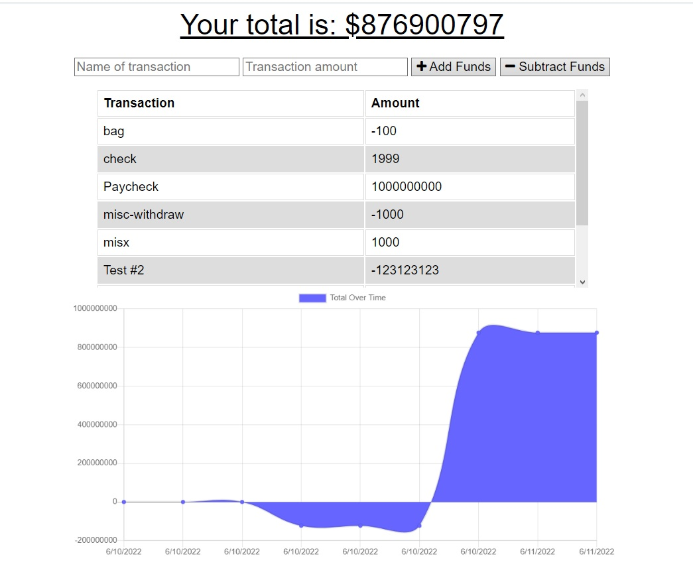

**Project Title:**

Offline Budget Tracker

---

**Project Description/Summary:**

Making updates to an existing budget tracker application to allow for offline access and functionality. This will allow users to add expenses and deposits to their budget with or without an internet connection. If the users enter a transaction offline, the total will be updated when they are back online.

---

**Live Site:**

Check out the deployed site [here](https://secret-springs-00862.herokuapp.com)!

---

**Technology Used:**

- Mongoose
- JavaScript
- HTML
- CSS
- Morgan
- Express.js

---

**Installation:**

Use _npm i_ to install npm packages.

**Screenshot:**

